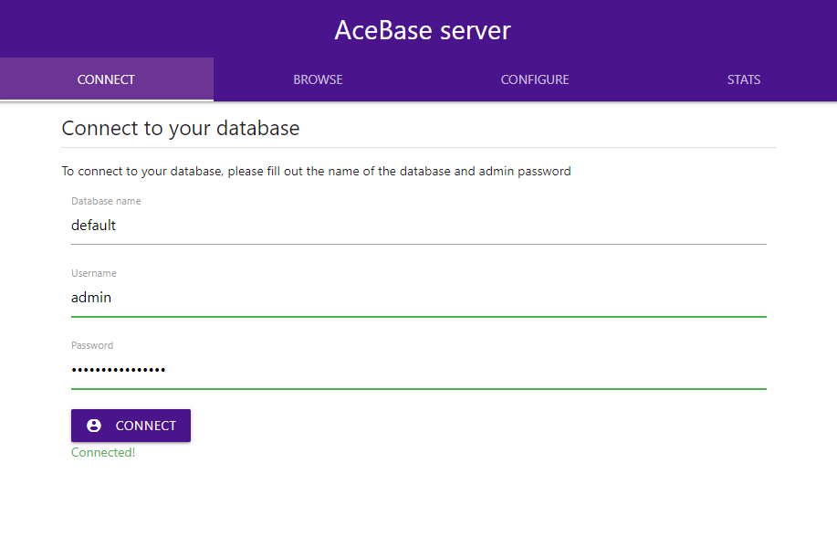
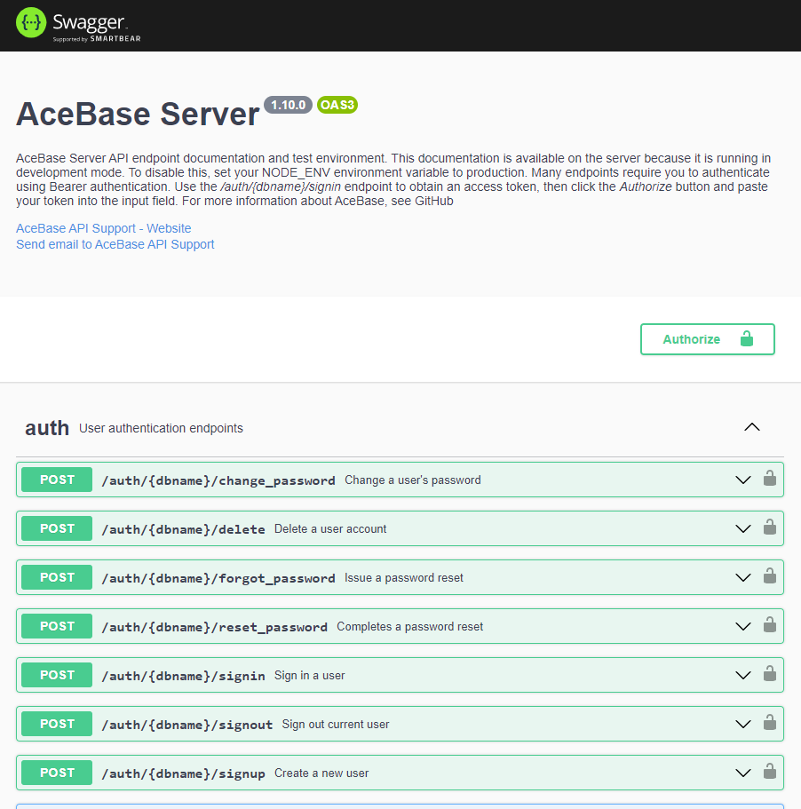

# AceBase realtime database server

This repository is to setup an http endpoint for a local AceBase database instance. See [AceBase](https://www.npmjs.com/package/acebase) for more information about AceBase databases and usage.





## Getting started

Install the *acebase-server* npm package: ```npm install acebase-server``` ([github](https://github.com/appy-one/acebase-server), [npm](https://www.npmjs.com/package/acebase-server))

To test running an AceBase server with authentication on localhost:3000, execute the following commands
* `cd ./node_modules/acebase-server`
* `npm run test`
* Open [http://localhost:3000](http://localhost:3000) in your browser. To sign into the webmanager, use db name `default`, username `admin` and the generated password displayed in your console output. The webmanager allows browsing your database content and performing updates.
* Open [http://localhost:3000/docs](http://localhost:3000/docs) to open the Swagger UI that is enabled in development mode. All REST API methods are documented and can be executed here.

## Creating an AceBase server

To launch an AceBase webserver using default settings
- requires users to sign in (denies anonymous access)
- runs without SSL (http)

```javascript
const { AceBaseServer } = require('acebase-server');
const dbname = 'mydb';
const server = new AceBaseServer(dbname, { host: 'localhost', port: 5757 });
server.on("ready", () => {
    console.log("SERVER ready");
});
```

**NOTE**: The above code will create an admin user with a generated password, which will be displayed once in the console output. Only randomly salted SHA512 hashes of user passwords are stored in the auth database, so it'll become _fairly hard_ to sign into the admin account if you don't copy/paste the password somewhere. If you don't want to use a generated password, see _Enable authentication_ below for info about how to supply a default password.

### Enable SSL (https)

To run the server on a secure https connection, you can simply provide details about the location of your certificate files:

```javascript
const settings = {
    host: 'mydb.example.com',
    port: 443,
    https: {
        certPath: './mycertificate.pem',
        keyPath: './myprivatekey.pem'
    }
};
const server = new AceBaseServer(dbname, settings);
```

You can either pass ```certPath``` and ```keyPath```, or ```pfxPath``` and ```passphrase``` - depending on the type of certificate files you have.

### Enable transaction logging
(NEW, BETA)

AceBase now supports transaction logging to facilitate sophisticated synchronization options and custom data recovery. Using cursors that indicate certain points in time, this allows for fast and easy synchronization of data between an AceBase server and multiple clients, or other server instances. This functionality is currently in BETA stage and will be tested extensively in the coming weeks. 

To enable transaction logging on your database, add the `transactions` setting:
```js
const server = new AceBaseServer(dbname, { 
    host: 'localhost', port: 443,
    transactions: { 
        log: true,      // Enable
        maxAge: 30,     // Keep logs of last 30 days
        noWait: false   // Data changes wait for log to be written
    }
};
```

### Enable authentication

Authentication settings determine who is allowed access to your server. By enabling authentication, the server will allow users to sign in (and signup) and authorization rules to be defined for data being read/written to the database.

```javascript
const settings = {
    host: 'mydb.example.com',
    port: 80,
    authentication: {
        enabled: true,
        allowUserSignup: false,
        defaultAccessRule: 'auth',
        defaultAdminPassword: '75sdDSFg37w5'
    }
}
```

The following `authentication` settings are available:
- `enabled`: whether to enable user authentication (default: `true`)
- `allowUserSignup`: whether users can sign up for an account themselves, or if the admin has to (default: `false`)
- `defaultAccessRule`: default authorization rule for read/write operations. Either `deny`, `allow` or `auth`. The first time the server is launched with authentication enabled, it will create a *rules.json* file that contains this access rule for any path. `deny` will deny all users (except admin) read/write access, `allow` will grant access to anyone, `auth` will grant access only to authenticated users (default: `auth`)
- `defaultAdminPassword`: supply a default password for the admin account that will be used when it is created. If you do not supply this, a generated password will be used instead and displayed only once in the console output.

### Setup authorization rules

If you enabled authentication, you can also define access rules for your data. Using rules, you can allow or deny specific (or anonymous) users _read_ and/or _write_ access to your data. These rules are similar to those used by [Firebase](https://firebase.google.com/docs/database/security/), but they are not identical. AceBase has easy ".schema" rules allow for an easy and clean way to validate data being written, while ".validate" rules allow you to check existing data and use more advanced business logic. The rules can be saved to the _rules.json_ file in your database directory, and can be overridden and extended programmatically from within your own code: ".validate" rules are coded in JavaScript (see [Coding your rules](#coding-your-rules)). The default rules written to the file are determined by the `defaultAccessRule` authentication setting at the first server launch with `authentication` enabled.

The default _rules.json_ file content is based on the value of the `defaultAccessRule` setting, possible values are:
 * `"auth"`: Only allow authenticated users read/write access to the database
 * `"allow"`: Allow anyone (including anonymous users) read/write access to the database
 * `"deny"`: Deny anyone (except admin user) read/write access to the database

When `defaultAccessRule: "auth"` is used, it will generate the following _rules.json_ file:
```json
{
    "rules": {
        ".read": "auth !== null",
        ".write": "auth !== null"
    }
}
```

When `"allow"` or `"deny"` is used, the `".read"` and `".write"` properties will be set to `true` or `false` respectively.

If you want to further restrict what data users can _read_ and/or _write_ to (RECOMMENDED!), you could edit the file as such, granting users _read_/_write_ access to their own user node:
```json
{
    "rules": {
        "users": {
            "$uid": {
                ".read": "auth.uid === $uid",
                ".write": "auth.uid === $uid"
            }
        }
    }
}
```

NOTE: Just like Firebase, access is denied by default if no rule is found for a target path. If an access rule is found at any location in the path, it will be used for any child path UNLESS your rule returns "cascade" (v1.17.0+). This means that, unlike Firebase, _read_ and/or _write_ access for child/descending paths CAN be overridden if you need to. "cascade" simply instructs the rule parser to postpone the decision making if the request is made on a child path, which is essentially as if there was no rule set for the current path. If the request is made on the rule path itself though, "cascade" will deny access because it is the last rule to execute and no access was granted.

For example, if you want to allow users _read_ access to a path, and _write_ access only for specific child path(s), use the following rules:

```json
{
    "rules": {
        "shop_reviews": {
            "$shopId": {
                ".read": true,
                "$uid": {
                    ".write": "auth.uid === $uid"
                }
            }
        }
    }
}
```
Above rules enforces:
* No _read_ or _write_ access to the root node or any child for anyone. (No rule has been set for those nodes, access will be denied)
* _Read_ access to all reviews for specific shops ('shop_reviews/shop1', 'shop_reviews/shop2') for anyone, including unauthenticated clients (`".read"` rule is set to `true`)
* _Write_ access to an authenticated user's own review for any shop. (`".write"` rule is set to `"auth.uid === $uid"`)

If you want to allow a specific user _read_/_write_ access to a path, and only _read_ access to a specific child path for all other users:
```json
{
    "rules": {
        "users": {
            "$uid": {
                ".read": "auth?.uid === $uid ? 'allow' : 'cascade'",
                ".write": "auth.uid === $uid",
                "public": {
                    ".read": true
                }
            }
        }
    }
}
```
Above rules enforces:
* No _read_ or _write_ access to the root node or any child for anyone. (No rule has been set for those nodes, access will be denied)
* _Read_ access for an authenticated user's own data in "users/$uid", including all child data
* No _read_ access for unauthenticated users and/or other users to "users/$uid", undecided _read_ access (`'cascade'`) for child paths. NOTE `auth?.uid` needs the `?.` to allow unauthenticated users to cascade - if rule execution fails it ALWAYS denies access.
* _Read_ access for everyone to "users/$uid/public" (if `users/$uid/.read` cascaded, `users/$uid/public/.read` is `true`)
* _Write_ access to an authenticated user's own data in "users/$uid" and all child data (`".write"` rule is set to `"auth.uid === $uid"`)

NOTE that `"allow"` can be returned from a rule function instead of `true`, and `"deny"` instead of `false`, `undefined` or other _falsy_ values. 

### Rule environment variables and functions
_(NEW v1.17.0+)_

Besides the `auth` variable used in above examples, there are other variables and functions you can use in your rule definitions. You can use these to determine if the data to be read or written conforms to your business logic. The following variables and functions are available in your `.read` and `.write` rules:
* `auth`: The currently signed in user (or `null` for anonymous access)
* `now`: a `number` with the current time in ms (you can also use `Date.now()`)
* `path`: a `string` containing the current path being read/written
* `operation`: one of the following values: 
    * _read_ operations `'get'`, `'reflect'`, `'exists'`, `'query'`, `'export'`
    * _write_ operations `'update'`, `'set'`, `'delete'`, `'transact'`, `'import'`
* `data`: data being written to the target, only available in `.validate` rules for `'update'` and `'set'` _write_ operations. Read more about `'.validate'` rules [here](#validate-data-being-written)
* `context`: contextual data that was passed along with _write_ operations in client code.
* `value`: an asynchronous function that gets a value from the database at a relative (`./property`, `../other/property`) or absolute (`/collection/item`) path. You can use this to check any existing data in the database to determine if the operation is allowed. For example, use `await value('./locked') !== true` to check if the `locked` property of the current target path is not set to `true`. It's possible to selectively load data from the given path by passing an additional `include` argument: `const contributors = await value('invoices', ['*/paid']); const allow = Object.keys(invoices).every(id => invoices[id].paid === true); return allow;`: this only allows access if all of the linked `invoices` have been paid.
* `exists`: an asynchronous function that checks if the value of a relative (`./property`) or absolute (`/collection/item`) path currently exists in the database. For example, you can use `await exists('./authors/' + auth.uid)` to check if current user is one of the authors of an item being written to.
* `$variable`: the value of a variable in your rules path. If the rule is set on path `posts/$postId` and the path being updated is `posts/lcoq4mnp000008mkaqk9hx9d`, then `$postId` will be `lcoq4mnp000008mkaqk9hx9d`

Note that instead of using the `operation` variable, you can also specify specific rules for each operation: the rules `".write": "true", ".set": "auth.uid !== null"` allow all users to write data to nested paths, but restrict `set` operation to signed in users only. The same can be done with a single `write` rule: `".write": "operation !== 'set' || auth.uid !== null"` or more verbose: `".write": "if (operation !== 'set') { return true; } else { return auth.uid !== null }"`

Remember that above rules cascade to child paths, and are therefore enforced for all data being read from or written to child/descendant paths - once a rule allows or denies access, this cannot be overridden by rules defined on nested child paths. The only exception to this are `.validate` rules that are evaluated on the target paths being read from or written to. If a parent `.write` rule allows access, a `.validate` rule on the target path is still able to deny access.  

### Validate data being written
_(NEW v1.17.0+)_

In addition to the read/write rules explained above, AceBase now supports defining `.validate` rules. In contrast to `.read` and `.write` rules, `.validate` rules do not cascade and are enforced on the target path only. This allows you to validate the data being written to specific paths. `.validate` rules are executed after verifying that a `.write` rule grants access. They fully support JavaScript, so you can use the same checks you'd use in client side code to validate your data with. As a general rule, use `.validate` rules only if you have to perform checks that `.schema` rules can't handle, such as using current data in the database, or advanced type checks such as string length.  

The following additional variables are available to `'.validate'` rules:
* `data`: data being written to the target for `'update'` and `'set'` _write_ operations. `'transact'` operations are executed in 2 steps: a `'get'` _read_ operation, followed by a `'set'` _write_ operation. Note that `'import'` operations use streaming updates and their data cannot be validated with `'.validate'` rules before they are stored to the database; use `'.schema'` rules to validate data being imported, or deny imports altogether using `if (operation === 'import') { return 'deny' }` in your `.write` rule, or by simply setting `{ ".import": false }`.

NOTE: keep in mind that the `value` for `'update'` operations are partial objects to update the existing stored value with. If your `.validate` rule checks for property existence or their values, make sure you allow missing properties if the operation is `'update'` (or use a `.schema` rule instead)

Example: validate writes to _/widget_
```json
{
    "rules": {
        "widget": {
            ".write": true,
            // a valid widget must have attributes "color" and "size", but ignore update operations (partial objects!)
            ".validate": "operation === 'update' || ('color' in data && 'size' in data)",
            "size": {
                // the value of "size" must be a number between 0 and 99
                ".validate": "typeof data === 'number' && data >= 0 && data <= 99"
            },
            "color": {
                // the value of "color" must exist as a key in /valid_colors (eg /valid_colors/black)
                ".validate": "typeof data === 'string' && await exists(`/valid_colors/${data}`)"
            }
        }
    }
}
```

The above example could be combined with `.schema` rules to make these checks easier. See [Schema validation](#schema-validation) below for more info.
```json
{
    "rules": {
        "widget": {
            ".write": true,
            // add required "color" and "size" types to schema definition
            ".schema": "{ color: string; size: number }",
            "size": {
                // the value of "size" must be a number between 0 and 99
                ".validate": "data >= 0 && data <= 99"
            },
            "color": {
                // the value of "color" must exist as a key in /valid_colors (eg /valid_colors/black)
                ".validate": "await exists(`/valid_colors/${data}`)"
            }
        }
    }
}
```

### Schema validation

AceBase server supports TypeScript-like schema definitions and validation. Once you've defined a schema for a path, all data being written must adhere to the set schema. Data to be stored/updated will be validated against the schema and denied or allowed accordingly.

There are 2 ways to can add schemas:
- In your `rules.json` file, see below.
- Programmatically through `db.schema.set`. See the [AceBase documentation](https://github.com/appy-one/acebase#adding-schemas-to-enforce-data-rules) for more info.

To ensure all users have a `name` (string), `email` (string) and `language` (either Dutch, English, German, French or Spanish), optionally a `birthdate` (Date) and `address` (custom object definition), add the following to your _rules.json_ file:
```json
{
    "rules": {
        "users": {
            "$uid": {
                ".read": "auth.uid === $uid",
                ".write": "auth.uid === $uid",
                ".schema": {
                    "name": "string",
                    "email": "string",
                    "language": "'nl'|'en'|'de'|'fr'|'es'",
                    "birthdate?": "Date",
                    "address?": {
                        "street": "string",
                        "city": "string",
                        "country": "string",
                        "geo?": {
                            "lat": "number",
                            "lon": "number"
                        }
                    }
                }
            }
        }
    }
}
```

You can also decide to split the schema up into multiple levels:
```json
{
    "rules": {
        "users": {
            "$uid": {
                ".read": "auth.uid === $uid",
                ".write": "auth.uid === $uid",

                ".schema": {
                    "name": "string",
                    "email": "string",
                    "language": "'nl'|'en'|'de'|'fr'|'es'",
                    "birthdate?": "Date",
                    "address?": "Object"
                },

                "address": {
                    ".schema": {
                        "street": "string",
                        "city": "string",
                        "country": "string",
                        "geo?": "Object"
                    },

                    "geo": {
                        ".schema": {
                            "lat": "number",
                            "lon": "number"
                        }
                    }
                }
            }
        }
    }
}
```

And, if you prefer, schema definitions can be defined as strings instead:
```json
{
    "address": {
        ".schema": "{ street: string, city: string, country: string, geo?: { lat: number, lon: number } }"
    }
}
```

## Coding your rules
_(NEW v1.17.0+)_

Instead of writing your rules into the `rules.json` file on your server, it is also possible to configure them in your code. Any rule you set with code will override or augment existing rules found in the `rules.json` file, so can use both. Coding your rules has a number of advantages:
* You can use the same rule definitions and functions on multiple paths without copy/pasting
* You can code them in your favorite editor
* You can use running server values and cached data in your rules, such as `process.env` and vars like `maintenanceMode`
* Rules become debuggable!

To add a rule in your code, use the following syntax:
```js
server.setRule(path, ruleTypes, async (env) => { /* your rule code */ });
```
where:
* `path` is the exact database path to set the rule, such as `'users/$uid'`, or an array of paths.
* `ruleTypes` is either 1 rule type like `read`, or multiple in an array like `['read', 'write']`

The callback function is an `async` function that receives all available environment variables in the `env` argument: `env.auth` will contain the `auth` object, `env.vars` the `vars` object etc. If you use the ES6 destructuring syntax, you can use the same rule syntax from your `rules.json` file: `async ({ auth }) => auth !== null`

It is best to setup your rules while AceBase Server is starting up, before it is accepting connections. To do this, you can pass an `init` callback function to the server settings that is executed right before the http server is started:

```js
const server = new AceBaseServer('mydb', {
    host: 'localhost',
    port: 4000,
    // ...
    async init(server) {
        // Allow read and write access to users' own data
        server.setRule('users/$uid', ['read', 'write'], ({ auth, vars }) => auth.uid === vars.$uid);

        // Limit user status to either 'online' or 'offline'
        server.setRule('users/$uid/status', 'validate', ({ data }) => ['online', 'offline'].includes(data));

        // Only allow following existing users
        server.setRule('users/$uid/following/$otherUid', 'validate', async ({ vars, exists }) => await exists(`/users/${vars.$otherUid}`));
    }
});
```

NOTE that you can use the `env.vars` object to get access to the values of named wildcards in your database paths. The values are also exposed as `env.$name`, but you can't use them this way in TypeScript because they can't be predefined in the `env` type.

NOTE now this `init` method is available, is is advisable to also move any `server.extend`, `server.db.schema.set`, `server.configAuthProvider` and `server.router.get` etc calls you'd have here!

## Sending user e-mails [NEW]

If your app allows users to sign up, you'll need a way to verify their e-mail addresses, send welcome and password reset e-mails etc. AceBase Server does not send the e-mails itself (yet), but provides a way to handle this yourself:

```javascript
const server = new AceBaseServer(('mydb', { host: 'localhost', port: 5757, authentication: { enabled: true, allowUserSignup: true }, email: { send: sendRequestedEmail } });

function sendRequestedEmail(request) {
    switch (request.type) {
        case 'user_signup': {
            console.log(`Should send an e-mail to ${request.user.email} to verify their e-mail address with code ${request.activationCode}`);
            break;
        }
        case 'user_reset_password': {
            console.log(`Should send an e-mail to ${request.user.email} to reset their password with code ${request.resetCode}`);
            break;
        }
    }
}
```

Any links you would add to the e-mails you send out should point to your own website/app, where you would handle account verification / password resets through an `AceBaseClient` connected to your server:

```js
const resetCode = 'weydgaed7gjsdhfjadbsfadsfasq3w7dtuqwebd'; // eg from your_reset_url?code=weydga...
const newPassword = 'MyNewPassword'; // from user input on your page
try {
    await client.auth.resetPassword(resetCode, newPassword);
    // User can now sign in with their new password
}
catch(err) {
    // Something went wrong
}
```

OR, if you have direct access to your AceBaseServer instance from your website:

```javascript
await server.resetPassword(req.ip, resetCode, newPassword);
```

To verify a user's email address:
```javascript
const verificationCode = 'weydgaed7gjsdhfjadbsfadsfasq3w7dtuqwebd'; // eg from your_verify_url?code=weydga...
await client.auth.verifyEmailAddress(verificationCode);
```

OR, directly on your server:

```javascript
await server.verifyEmailAddress(req.ip, verificationCode);
```

### E-mail request examples

If you've configured the email settings with a function like `sendRequestedEmail` in the example above, your function will be called with e-mail requests with the following formats:

Request type *user_signup*:
```js
{
    "type": "user_signup",
    "user": {
        "uid": "knq2aynt000dnc7bwt8gpj0c",
        "email": "me@appy.one",
        "displayName": "Ewout",
        "settings": {}
    },
    "ip": "127.0.0.1",
    "date": new Date("2021-04-20T13:27:46.937Z"),
    "activationCode": "eyJ2IjoxLCJjcyI6ImNlMGRlYTgxM...",
    "emailVerified": false,
    "provider": "acebase"
}
```

Request type *user_reset_password*:
```js
{
    "type": "user_reset_password",
    "user": {
        "email": "me@appy.one",
        "uid": "knq3eq5w0005jg7b3vym9fgr",
        "settings": {},
        "displayName": "Ewout"
    },
    "ip": "127.0.0.1",
    "date": new Date("2021-04-21T07:19:26.588Z"),
    "resetCode": "eyJ2IjoxLCJjcyI6ImI4ZTE5MGE5NTA3YT..."
}
```

Request type *user_reset_password_success*:
```js
{
    "type": "user_reset_password_success",
    "user": {
        "uid": "knq3eq5w0005jg7b3vym9fgr",
        "email": "me@appy.one",
        "displayName": "Ewout",
        "settings": {}
    },
    "ip": "127.0.0.1",
    "date": new Date("2021-04-21T10:15:28.148Z")
}
```

## Using third party login providers

You can enable users to sign into your app through a third party login provider, such as Facebook, Google, Twitter etc. To enable this, follow these steps for each provider:

* First, get `client_id` and `client_secret` API keys from the auth providers' developer environment. This will allow your app to use with the provider's auth API.

* Most OAuth providers restrict authentication callback uri's to a predefined set of uris, so make sure you add AceBase's callback URL in the provider's API settings: `"https://your.acebase.server/oauth2/dbname/signin"` (replace hostname and dbname to your server Url)

* Then, add your API keys to your `AceBaseServer` config with `configAuthProvider`:

```javascript
server.configAuthProvider('facebook', { client_id: '[your fb app_id]', client_secret: '[your fb app_secret]', scopes: [/* Any additional scopes, such as 'user_birthday' */] });
```

* Now, you can kick off Facebook authentication in your app:
```javascript
// In your login.js:
const callbackUrl = 'http://your.app.url/authenticated';
client.auth.startAuthProviderSignIn('facebook', callbackUrl)
.then(redirectUrl => {
    window.location = redirectUrl; // Send user to auth provider's login screen
});
```

* Once the user authenticated your request, they are redirected back to your website (your callbackUrl):
```javascript
// In your authenticated.js: (executes from /authenticated?result=awefi873r4gqw...)
const callbackResult = window.location.search.match(/[?&]result=(.*?)(?:&|$)/)[1]; // Or some other way you'd get the ?result from the url
client.auth.finishAuthProviderSignIn(callbackResult)
.then(result => {
    console.log(`User ${result.user.email} signed in with ${result.provider.name}`);
})
```

The `result` object will also contain the provider's `access_token` and `refresh_token` in case you want to make custom calls to the provider's API. If you want to keep the provider's access_token active, you will have to call `client.auth.refreshAuthProviderToken` before it expires:

```javascript
const keepAlive = (provider) => {
    // Schedule token refresh 1 minute before it expires
    const refreshMs = (provider.expires_in - 60) * 1000;
    setTimeout(() => {
        client.auth.refreshAuthProviderToken(provider.refresh_token)
        .then(result => {
            keepAlive(result.provider); // Schedule again
        })
    }, refreshMs);
};

client.auth.finishAuthProviderSignIn(callbackResult)
.then(result => {
    // schedule a token refresh:
    keepAlive(result.provider);
});
```

Currently implemented auth providers are:
* Google
* Facebook*
* Spotify

*NOTE: Facebook access tokens are short-lived by default, but will be exchanged for a long-lived (60 day) access token upon refresh. If you need to keep the Facebook access token active, execute `refreshAuthProviderToken` immediately after `finishAuthProviderSignIn`, and keep refreshing every time the user starts your app. Once a Facebook access token has expired, it cannot be refreshed and the user will have to sign in again.

## Add cloud functions to handle data changes

You can add "cloud functions" to perform custom tasks upon data changes. You can do this in 2 ways:

* In the same process you are running your `AceBaseServer` (requires server v1.1+). Make sure you run cpu heavy code in a separate worker thread to keep the server thread available for core tasks:
```js
const server = new AceBaseServer(dbname, settings);
await server.ready();

// Monitor images being added by users, resize them to multiple sizes:
server.db.ref('uploads/images').on('child_added', async snap => {
    const image = snap.val();
    const resizedImages = await createImageSizes(image); // Some function that creates multiple image sizes in a worker thread
    const targetRef = await db.ref('images').push(resizedImages); // Store them somewhere else
    await snap.ref.remove(); // Remove original upload
});
```

* Connect to your server with an AceBaseClient in a separate nodejs app, sign in as admin (or other user with rights to the data you want to read/write), add your custom event handlers.

```js
const db = new AceBaseClient({ host: 'localhost', port: 5757, dbname: 'mydb', https: false });
await db.ready();
await db.auth.signIn('admin', 'thepassword');

// Monitor images being added by users, resize them to multiple sizes:
db.ref('uploads/images').on('child_added', async snap => {
    const image = snap.val();
    const resizedImages = createImageSizes(image); // Some function that creates multiple image sizes
    const targetRef = await db.ref('images').push(resizedImages); // Store them somewhere else
    await snap.ref.remove(); // Remove original upload
});
```

## Extending the server API

To extend the server's endpoints, there are 2 options:
* Use `server.router.get` and `server.router.post` etc to add custom Express endpoints to the server.
* Use `server.extend` to create an endpoint that can be called by an AceBaseClient using `client.callExtension`

### Using Express router

Simply add your routes with `server.router.get`, `.put`, `.post` etc. You can use `req.user` to check if it is an authenticated request - your client code must add the `Authorization: Bearer [token]` header to requests in order for this to work.
```js
server.router.get('/membersonly', (req, res) => {
    if (!req.user) {
        return res.status(403).send('Members only');
    }
    res.send(`Welcome ${req.user.display_name}`);
});
```

If you want to create your own router to bind custom routes to:
```js
const myRouter = server.app.createRouter();
// Bind the new router to /myroutes
server.router.use('/myroutes', myRouter);
// Add routes to own router
myRouter.get('custom1', handleMethod1); // /myroutes/custom1
myRouter.get('custom2', handleMethod1); // /myroutes/custom2
```

### Using `server.extend`

You can add your own custom API functions to the server with the `server.extend(method, path, handler)` method:

```javascript
const server = new AceBaseServer(...);
await server.ready();

const _quotes = [...];
server.extend('get', 'quotes/random', (req, res) => {
    const index = Math.round(Math.random() * _quotes.length);
    res.send(quotes[index]);
});
server.extend('get', 'quotes/specific', (req, res) => {
    const index = req.query.index;
    res.send(quotes[index]);
});
server.extend('post', 'quotes/add', (req, res) => {
    const quote = {
        text: req.body.text,
        author: req.body.author
    };
    quotes.push(quote);
    res.send('thanks!');
});
```

You can then call your API methods on the client side as follows:
```javascript
// Get random quote:
client.callExtension('get', 'quotes/random')
.then(quote => {
    console.log(`Got random quote: `, quote);
});

// Get specific quote:
client.callExtension('get', 'quotes/specific', { index: 15 })
.then(quote => {
    console.log(`Got quotes[15]: `, quote);
});

// Add a quote
client.callExtension('post', 'quotes/add', { 
    text: 'The greatest glory in living lies not in never falling, but in rising every time we fall', 
    author: 'Nelson Mandela' })
.then(result => {
    // "thanks!"
});
```

## Running in a cluster

It is possible to run your *AceBaseServer* in a cluster so you can utilize more than just the 1 CPU a Node.js application typically uses. To make sure all instances can read and write to the same database files safely they will have to be able to communicate with each other. This is done using a technique called interprocess communication (IPC). Node.js' built-in cluster functionality provides IPC channels to communicate between master and worker processes, but if you want to run a `pm2` cluster or want multiple instances running in the cloud, you'll have to use an external IPC server. See [AceBase IPC Server](https://github.com/appy-one/acebase-ipc-server) for more information about the different clustering solutions and code examples.

## Connecting to a server

See *acebase-client* on [npm](https://www.npmjs.com/package/acebase-client) or [github](https://github.com/appy-one/acebase-client)

## Upgrade notices

v0.9.7: user accounts and server logs are now stored in the target database, instead of in a seperate auth database. If you upgraded from version 0.9.6 or lower and want to keep using the existing auth database, start the server with ```seperateDb: true``` in the options.